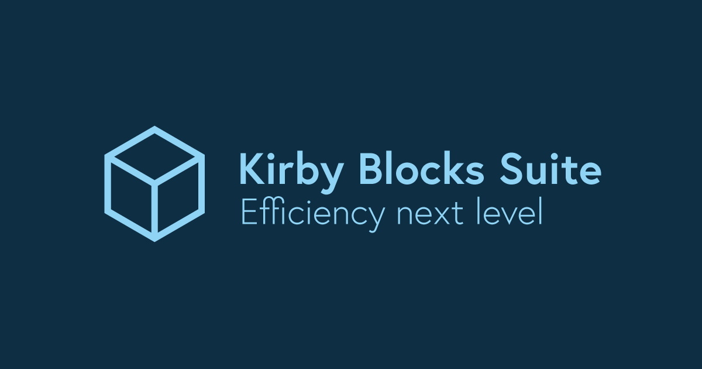

# Kirby Blocks Suite





Create Kirby blocks now in no time without time-consuming typescript programming and annoying switching between folders. 
Increase your productivity by creating blocks for all your website elements and use it everywhere and over and over again.

It is recommended that you have experience with [Kirby Blocks](https://getkirby.com/docs/guide/page-builder). However, this is not necessary.

In this documentation, we will create a page builder together from scratch. You will be a Blocks Suite Pro in just a few moments.

> ⚠️ This plugin is currently in alpha version. Use it at your own risk.

## Features

- [Use a single block](#use-a-single-block)
- [One place for your blocks](#one-place-for-your-blocks)
- [Insert a block manually](#insert-a-block-manually)
- [Reuse Blocks](#reuse-blocks)
- [Preview](#preview)
  - [Single field for preview](#single-field-for-preview)
  - [Multiple fields for preview](#multiple-fields-for-preview)
  - [Tabs for preview](#tabs-for-preview)
  - [Header preview](#header-preview)
  - [Block Width](#block-width)
- [Nesting Blocks](#nesting-blocks)
- [Subblocks](#subblocks)
- [Inject blocks](#inject-blocks)


## Installation

**Manually**

[Download](https://github.com/plain-solutions-gmbh/kirby-blocks-suite) and unzip the content into your plugin folder: `/site/plugins/`

**With Composer**

```bash
composer require getplain/kirby-blocks-suite
```

**Before we start...**

Skip this chapter if you intend to work directly on a project with this plugin.


But if you like to rebuild the examples in this documentation, follow these steps:

* Install the [Kirby starterkit](https://getkirby.com/docs/guide/quickstart#installing-kirby) and make it running (e.g. on `localhost`).
* Create these files *(If you read  **Page Blueprint** or **Page Template** in this manual use these files)*:

    _Page Blueprint (/site/blueprints/pages/demo.yml):_
    ```yml
    title: My Page Builder
    # Blueprint code goes here:
    ```

    _Page Template (/site/templates/demo.php):_
    ```php
    <?php snippet('header') ?>
      <!-- Template code goes here: -->
    <?php snippet('footer') ?>
    ```

    _Content (/content/demo/demo.txt):_
    ```
    Title: My Page Builder
    ```

* Go to `localhost/panel/pages/demo`

# Features

## Use a single block

On top of the *Blocks Field* you can use now the *Block Field*:

_Page Blueprint (/site/blueprints/pages/demo.yml):_
```yml
fields:
  fruits:
    label: Types of fruit
    type: block
    fieldset: list
```

_Page Template (/site/templates/demo.php):_
```php
<?= page()->fruits()->toBlock() ?>
```

**Panel output:**


As you see: All fields that are usually displayed in the block's drawer, appears now in the panel window.

> 💥 You can use now blocks like an *[Object Field](https://getkirby.com/docs/reference/panel/fields/object)*.

## One place for your blocks

No more jumping between the *blueprints* and the *snippets* folder. Use the `site/block` folder for your block collection.

|  | With Kirby Blocks | With Blocks Suite |
| :-------- | :------------- | :------------- |
| Blueprint | site/blueprints/blocks/my_block.yml | site/blocks/my_block/my_block.yml |
| Snippets | site/snippets/blocks/my_block.php | site/blocks/my_block/my_block.php |
| Preview | /site/plugins/my_block/index.php<br>/site/plugins/my_block/index.js<br>/site/plugins/my_block/components/my_block.vue | (managed in blueprint) |


**Example:**

_Article Block Blueprint (/site/blocks/article/article.yml):_
```yml
title: Article
icon: file-document

fields:
  title:
    type: text
  text:
    type: writer
  image:
    type: files
    multiple: false
```

_Article Block Template (/site/blocks/article/article.php):_
```html
<article class="note-excerpt">
  <header>
      <figure class="img" style="--w: 16; --h:9">
          image()->toFiles() ?>" alt="<?= $content->title() ?>">
      </figure>

    <h2 class="note-excerpt-title"><?= $content->title() ?></h2>
  </header>
  <div class="note-excerpt-text"><?= $content->text() ?></div>
</article>
```

The new Block is set up. And now we need to make it useable. For that we create a *blocks field* as we know from Kirby CMS.

_Page Blueprint (site/blueprints/pages/demo.yml):_
```yml
fields:
  section:
    type: blocks
    fieldsets:
      - article
```

**Panel output:**


To use it in your template, use the [toBlocks method](https://getkirby.com/docs/reference/panel/fields/blocks#blocks-in-your-templates):


_Page Template (site/templates/demo.php):_

```html
<?php snippet('header') ?>

  <?= $page->my_blocks()->toBlocks() ?>

<?php snippet('footer') ?>
```


## Insert a block manually

If you like to use a block hard-coded in your template. Nothing easier than that:

```php
block('article', [
  'title'		=> 'My custom article',
  'text'	  => 'Some exciting text',
  'image'		=> 'file://id-of-your-image',
])
```

## Reuse Blocks

Sometimes it could be useful to use a block with the same output twice, but with a different view in the panel.
In our example, we like to use our article block to view the team on our website.

All you need to do is to add a custom fieldset with the property `type` and overwrite desired props.

_Page Blueprint (site/blueprints/pages/demo.yml):_
```yml
fields:
  section:
    type: blocks
    fieldsets:
      - article
      team:
        type: article
        title: Team
        icon: account
        fields:
          title:
            label: Name
            required: true
          
```

Now we can add article and team. Everything with one type of block:


> 💡 You can adding new fields if you like.<br>💡 To _remove_ fields, hide them with `type: hidden`.<br>💡 Set default values per field with the `default` property: `default: My default value`

## Preview

Creating a preview could be a very time-consuming thing. In addition, fields that are displayed in the preview appear once again in the drawer.<br/>Now you have full control over your preview right in your blueprint with the `preview` property.


### Single field for preview

This example shows the field `title` in the preview. All the other fields can be found in the drawer.

_Article Block Blueprint (/site/blocks/article/article.yml):_
```yml
...
preview:
  field: title
...
```


> 🔥 The preview is collapsible and can be hidden/shown by clicking the angle icon. The state will be saved in your browser.<br/>
> 💡 In case you're using `preview`, the drawer doesn't open automaticly on block creation. (Unless `wysiwyg: false` is set)

### Multiple fields for preview

To move more than one fields from the drawer to the preview use the `fields` property:

```yml
preview:
  fields:
    - title
    - image
```

> 💡 If you like to use **all** fields for preview, set `preview: true`.

### Tabs for preview

If your block using tabs you can define a tab for the preview. The preview tab is no longer visible in the drawer.

```yml
preview:
  tab: my_preview_tab
```

> 💡 If your blueprint doesn't have tabs use `tab: content`.

### Header preview

`name`, `label`, `ìcon` and `image` of the preview's header can be taken from the content.<br/> To use this, add one or more of these properties to the preview array with the name of the desired field.

_Article Block Blueprint (/site/blocks/article/article.yml)_
```yml
preview:
  name: title
  label: text
  image: image
```


> 💡 If `image` is set, the `icon` disappears.

**More options...**

Elements in the preview header can have more options. To use more options, set the name of the field in an own property `field`.

- `field`: The name of the field.
- `options` _(optional)_: Works like a converter. _(See the example)_
- `default` _(optional)_: Defines the value if the value is empty or not in the options list (if `options` is given).

Example: Let's say the `ìcon` is `user` unless the field `title` contains a specific value.

```yml
preview:
  field: title
  label: title
  icon:
    field: title
    default: user
    options:
      'K.I.T.T.': car
      'Michael': star
      'Devon': pen
      'April': cog
```


> 💡 The item `image` has different [options](https://getkirby.com/docs/reference/panel/fields/files#image-options).<br/>
> 💡 If `default` is not set, kirby takes the information of the fieldset. There you can do something like `label: "Titel: {{title}}"`.

### Block Width

The `width` of the block can be also taken from the value. This can be done the same like described in the last chapter. You can use `field`, `default` and `options`.


But there is a new property: `format`

| Key | Description |
| :-------- | :------------- | 
| Columns (default) | The given value defines the times the block fits in the row. |
| Fraction | The value returns the part of the whole row. (e.g 2/3) |
| Options | The value will be converted (see `options` key) |
| (any number) | `format` will be devides by the value. (e.g. 12: 6 equals the half) | 
| (any chars) | Any other expression is used for the postfix (e.g. px, em, %) |


We define the field `columns` later in this manual. But you can set the preview property right now:

_Article Block Blueprint (/site/blocks/article/article.yml)_
```yml
preview:
  width: columns
...
```

## Nesting Blocks

Blocks can cascade very easily by using the `block` or the `blocks` field inside a block.

_Example:_ We create a block to wrap sections around our blocks. 

_Section Block Blueprint (/site/blocks/section/section.yml):_
```yml
title: Section
icon: grid-top-left
preview: true

fields:
  items:
    label: Items
    type: blocks
    fieldsets:
      - article
      team:
        type: article
        title: Team
        icon: account
        fields:
          title:
            label: Name
            required: true
```

_Section Block Template (/site/blocks/section/section.php)_
```html
<ul class="grid">
    <?php foreach ($content->items()->toBlocks() as $section): ?>
        <li class="column" style="--columns: 4">
            <?= $section ?>
        </li>
    <?php endforeach ?>
</ul>
```
_Page Blueprint (site/blueprints/pages/demo.yml):_
```yml
page_builder:
  label: Page builder
  type: block
  fieldset: section
```

## Subblocks

Subblocks are useful to group blocks that belong together or to outsource some parts of a block.

See here a folder structure to understand, how subblocks works:


To use a subblock set `fieldset: my_block/my_subblock` in a block(s) field.

Let's create a subblock which we use in the next chapter:

_Section Block Blueprint (/site/blocks/section/style.yml):_
```yml
title: Style
icon: cog

fields:
  columns:
    type: toggles
    required: true
    default: 1
    options:
      - 1
      - 2
      - 3
      - 4
```

## Inject blocks

You can use blocks as tabs in another blocks. Sounds complex, but once you understood the concept behind, it could be a very powerful tool.<br/>
To use this feature, just set the `tabs` property in your block or blocks fields with your desired blocks. Let's take a look in our example:

_Section Block Blueprint (/site/blocks/section/section.yml):_
```yml
title: Section
icon: grid-top-left
preview: true

fields:
  items:
    label: Items
    tabs: 
      - section/style
    type: blocks
    fieldsets:
      - article
      team:
        type: article
        title: Team
        icon: account
        fields:
          title:
            label: Name
            required: true
```
This affects, that all blocks (defined in the fieldset's properties) appears as tab in the blocks drawer.


**Set position**

By default, the injected blocks appear after the regular tab. You can change the order by setting `position: before`

```yaml
tabs:
  style:
    type: section/style
    position: before
```

**Extend existing tabs**

If the name of the tab already exists in the selected block, the fields of the tab will be merged by the injected block.<br/>
In our example, the `article` block doesn't have tabs. In this case, you can use `content` to modify/add fields.

```yaml
tabs:
  content:
    type: section/style
    position: before

```

> 💡 Use `position` to add fields before.
> 💡 Injected tabs can be extend in the block definition (See chapter **Reuse Blocks**)

**Available in the template**

The injected fields are also available in the block template with `$content->columns()`. _(In our example the value is in the `$section` item)_

_Section Block Template (/site/blocks/section/section.php)_
```html
<ul class="grid">
    <?php foreach ($content->items()->toBlocks() as $section): ?>
        <li class="column" style="--columns: <?= 12 / $section->columns()->value() ?>">
          <?= $section ?>
        </li>
    <?php endforeach ?>
</ul>

```

# F.A.Q.

Help me filling this chapter. [Write a issue](https://github.com/plain-solutions-gmbh/kirby-blocks-suite) or [contact me](https://plain-solutions.net/support).

# License

[Kirby Blocks Suite Plugin License Agreement](https://plain-solutions.net/license) License © 2024 [Plain Solutions GmbH](https://plain-solutions.net/)